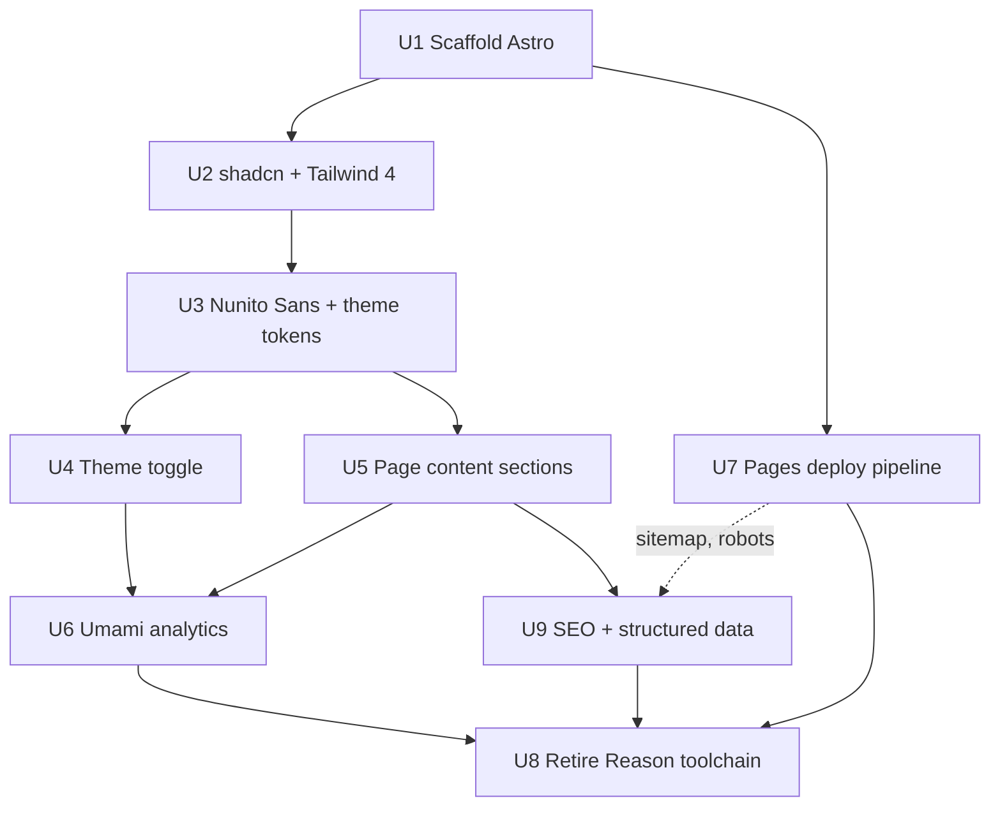

# feat: Rebuild portfolio as an Astro one-pager with shadcn/ui

> **Branch warning — read before committing anything.** This plan must live on the `dev` branch. The current `master` branch is a deploy artifact: `.github/workflows/main.yml` force-replaces `master`'s entire contents with the build output on every push to `dev`. Any file committed to `master` — including this plan — is silently destroyed on the next deploy. U7 removes this trap permanently.

## Summary

Replace the unmaintained ReasonML/BuckleScript toolchain with a statically-generated Astro site presenting Koushik as a hire-ready engineer: a single-page, text-first layout in the [leerob.com](https://leerob.com) / [paco.me](https://paco.me) tradition, built with shadcn/ui on Tailwind 4, with a light/dark/system theme toggle, Nunito Sans typography, Umami Cloud analytics on page loads and outbound social clicks, and deployment via GitHub's official Pages Actions pipeline.

---

## Problem Frame

The site is a two-route ReasonReact app that renders an avatar, a name, four links, and a page of bio text plus a hand-maintained tech-stack list. Its purpose has changed: Koushik is actively looking for opportunities and wants the site to communicate who he is to people evaluating him.

Three forces make a rebuild rather than a restyle the right call:

- **The toolchain is dead.** `bs-platform` 5 and ReasonML are unmaintained; ReScript superseded them. `npm install` on `dev` is unlikely to resolve cleanly on a current Node.
- **The current design works against the goal.** It leads with a hand-maintained "Tech Stack" list — the section great engineering portfolios conspicuously omit, because it dates instantly and says less than one described project would. Experience is absent, and projects punt to LinkedIn.
- **The instrumentation is dead too.** `src/analytics.js` initialises `UA-161006761-1`, a Universal Analytics property. Google stopped processing UA data on 1 July 2023, so the site has recorded nothing for three years.

---

## Requirements

- R1. A visitor understands who Koushik is, what he does, and how to contact him within roughly ten seconds of landing.
- R2. The site is a single page — no client-side routing.
- R3. Theme can be toggled between light, dark, and system; system is the default; the choice persists across visits and never flashes the wrong theme on load.
- R4. Typography uses Nunito Sans.
- R5. Components come from shadcn/ui, styled with its Tailwind-based token system rather than ad-hoc CSS.
- R6. Umami records page loads and records a distinct event when a visitor clicks through to LinkedIn, Medium, or GitHub.
- R7. Deployment uses GitHub's official Pages Actions pipeline (`actions/deploy-pages`), not the current branch force-push.
- R8. The site remains at `srikoushik.github.io` with no custom domain.
- R9. Source is simple and readable, following current framework conventions rather than clever abstraction.
- R10. The site is accessible and fast: keyboard-navigable, correct landmarks and contrast, and shipping no JavaScript except what the theme toggle genuinely requires.
- R11. The site is SEO-friendly: crawlable and indexable, with accurate metadata, a canonical URL, working social-share previews, and structured data that identifies Koushik as the subject of the page and links his external profiles.

---

## Scope Boundaries

- **No custom domain.** Staying on `srikoushik.github.io` (R8).
- **No self-hosted writing.** Articles continue to link out to Medium; no blog, MDX content collection, or RSS.
- **No CMS or admin.** Content lives in source.
- **No profile photo work.** Koushik is supplying a replacement image; the plan reserves the slot and defines the sizing/format contract only.
- **No copy authoring.** The plan defines the content *structure*; final wording is Koushik's (see Open Questions).
- **No on-page project write-ups.** Projects link out to LinkedIn by decision; writing links out to Medium.

### Deferred to Follow-Up Work

- Final copy, section ordering, colour/accent choices, and motion treatment — Koushik has explicitly deferred these for a later refinement pass.
- Résumé/CV PDF and an explicit "open to opportunities" banner — unanswered; likely valuable for R1 but not assumed here.
- Refreshing the Medium back-catalogue, or writing new posts to replace the 2020-era motorcycle articles as the most recent writing signal.

---

## Context & Research

### Current Implementation (branch `dev`)

- `src/home/home.re` — avatar, name, Me/Blog links, GitHub + LinkedIn SVG icons, GA events per link.
- `src/me/Me.re` + `src/header/Header.re` — bio, location (Chennai native, Bangalore-based), Interests, a four-category Tech Stack list, and a "Tap here to know more about my projects" link to LinkedIn.
- `src/modules/Route.re` — hash router: `""` → Home, `"me"` → Me.
- `src/analytics.js` — `react-ga` wrapping UA-161006761-1. Note the array indexing (`config[0]`, `config[1]`) is correct, not a bug: `bs-platform` 5 compiled ReasonML records to JS arrays.
- `webpack.config.js` — outputs `build/Index.js`; `.github/workflows/main.yml` deploys `build/` to `master` via `JamesIves/github-pages-deploy-action@releases/v3` using an `ACCESS_TOKEN` secret.
- `tailwind.css` — 875 KB of committed build output. Tailwind 1.x with PurgeCSS configured but evidently not eliminating anything. Tailwind 4 has no purge step at all — it generates only the utilities it finds in source — so this failure mode does not carry forward.
- **Current SEO state** (from `index.html` on `master`): title, meta description, `og:title`/`type`/`site_name`/`url`/`description`, and the Google site-verification tag are present. Missing: canonical link, Twitter Card tags, and any structured data. **`og:image` is set to a relative path** (`0f38c712deadd0a85b8bea1ff6d4d120.jpg`); Open Graph requires absolute URLs, so link previews on LinkedIn, Slack, and X are almost certainly rendering without an image today. The page body is also entirely JS-rendered — a `<div id="app">` filled by `Index.js` — which is strictly worse for crawlers than the static HTML Astro will emit.

### Content Inventory (what the sections can actually be filled with)

- **GitHub (23 public repos).** Mostly forks (`uCrop`, `Telegram`, `Zoomy`, `MaterialChipsInput`, `BubbleActions`, `echoip`) and 2019 Amdocs teaching repos. Genuinely original and substantive: `update-worker` (Spark → Redis), `bank-api-server`, `stock-analysis`, `rpn-calculator-tdd`, `REST-webService-using-spring-and-BDD`, and `komessage-skill` (Jun 2026, the only recent work). **A raw GitHub listing would undersell the candidate; Projects must be hand-curated.**
- **Medium (7 posts, newest Mar 2020).** Two technical (browser→S3 upload, GitLab CI for static React→S3), one on teaching, one Tamil poem, three on motorcycle gear. Curate 2–3; do not render a feed, which would foreground staleness.

### Verified External Facts (npm registry and vendor docs, 2026-07-26)

| Dependency | Version | Notes |
|---|---|---|
| `astro` | 7.1.4 | Requires Node ≥ 22.12 |
| `shadcn` (CLI) | 4.16.0 | Official Astro template: `shadcn@latest init -t astro` |
| `@astrojs/react` | 6.0.1 | Required by shadcn — components are React |
| `@tailwindcss/vite` | 4.3.3 | Tailwind 4, CSS-first config; no `tailwind.config.js` |
| `@radix-ui/react-slot` | 1.3.3 | Pulled in per-component, not wholesale |
| `class-variance-authority` | 0.7.1 | shadcn variant helper |
| `tailwind-merge` | 3.6.0 | shadcn `cn()` helper |
| `withastro/action` | v6 | Node 24 default; detects package manager from lockfile |
| `actions/deploy-pages` | v5 | Official Pages deployment |
| `actions/checkout` | v7 | |

- **shadcn is source you own, not a versioned dependency.** `shadcn add <component>` copies component source into `src/components/ui/`. There is no library to churn under you and no upgrade treadmill — which is precisely why it was chosen over Astryx (see Alternatives).
- **Astro is officially supported.** `shadcn@latest init -t astro` scaffolds it; existing projects need the Tailwind and React integrations configured first, plus an `@/*` path alias in `tsconfig.json`. Components import directly into `.astro` files.
- **shadcn requires Tailwind.** Its components are Tailwind classes over Radix primitives, and its theming is Tailwind 4 CSS variables (`--background`, `--foreground`, …) toggled by a `dark` class on the root element.
- **Nunito Sans** is on Google Fonts at v19 as a four-axis variable font: `wght` 200–1000, `wdth` 75–125, `opsz` 6–12, plus italic. Requesting every axis generates a very large set of `@font-face` rules; request `wght` only.
- **`CLAUDE.md` contains a stale line about typography.** Its Design section still reads "Typography - use Muli" while its later Updates section specifies Nunito Sans. This plan follows the Updates section as the more recent decision. Worth correcting the earlier line so the file has one answer. (For the record: Google Fonts delisted "Muli" in favour of "Mulish" years ago, so the original line was unbuildable as written anyway.)
- **Umami events** use `data-umami-event="<name>"` attributes (plus `data-umami-event-*` for string properties), or `umami.track(...)` in JS. Event names cap at 50 characters.
- **No `base` config needed.** The repo is named `srikoushik.github.io`, so it deploys at the domain root; only `site` is required — and `site` is what lets Astro emit the absolute URLs that canonical tags, Open Graph, and the sitemap all require.
- **`ProfilePage` is the right structured-data type**, per Google's rich-results gallery: `Person` on its own is not a supported type. Required shape is `@type: ProfilePage` with a `mainEntity` of `@type: Person` carrying at minimum `name`. Recommended additions relevant here: `image`, `description`, `alternateName`, and **`sameAs`** for external profile URLs.
- **Be realistic about what the markup buys.** `ProfilePage`'s documented rich result is the "Discussions and Forums" feature, which is aimed at community and forum creators — a personal portfolio will not get a visual rich result from it. Its actual value is **entity consolidation**: helping Google connect this site to the LinkedIn, GitHub, and Medium profiles as one identity via `sameAs`. That is the realistic SEO win for a personal site, and it is worth doing.

### Project Rules (`CLAUDE.md`)

> "Don't use any of your training data. Use the version that is available on the latest stable version on the stack website."

Every version in the table above was read today from the live npm registry and vendor documentation — not from memory. Because "latest stable" moves, the versions here are a snapshot: U1 and U2 re-verify at install time, and the resolved versions in `node_modules` become the source of truth from then on.

---

## Key Technical Decisions

- **Astro renders shadcn's React components to static HTML at build time.** Astro server-renders framework components with no client directive and ships zero JavaScript for them. This is what makes "Astro + a React component library" coherent rather than contradictory: every static component costs no runtime JS, and hydration is spent only where behaviour genuinely requires it.
- **The theme toggle is written in vanilla JavaScript, not as a React island.** It is the site's only interactive element. Hydrating it with React would ship `react` + `react-dom/client` (~45 KB gzipped at minimum) for one button, on a page that is otherwise pure text. The same behaviour is roughly thirty lines of plain DOM code toggling a class. This keeps the site at **zero framework JavaScript** and is simpler to read (R9, R10).
- **Tailwind 4 is adopted, reversing the instinct to avoid it.** shadcn requires it, and the 875 KB `tailwind.css` in this repo is not an argument against Tailwind — it is an artefact of Tailwind 1.x with a misconfigured PurgeCSS step. Tailwind 4 generates only the utilities it finds in source, so the failure mode is structurally absent. Config is CSS-first; there is no `tailwind.config.js`.
- **A blocking inline script sets the theme before first paint.** Reading `localStorage` and applying the theme class in a deferred script guarantees a visible flash of the wrong theme. The resolver must run inline and synchronously in `<head>` (R3).
- **Follow shadcn's `dark`-class convention rather than inventing a `data-theme` attribute.** Its CSS variables are already wired to it, and matching the library's convention keeps the code idiomatic and readable (R9).
- **The site carries an explicit payload budget.** Budget: **0 KB framework JS**, and **≤ 30 KB gzipped CSS** total. U2 measures against this and records the baseline; later units are held to it.
- **Umami over GA4.** Chosen by Koushik. It also avoids a cookie-consent obligation, which GA4 on a personal site would arguably incur.
- **Deploy replaces rather than adapts the existing workflow.** `withastro/action@v6` + `actions/deploy-pages@v5` publishes from an ephemeral artifact, so `master` stops being a deploy target and can hold source and docs safely (R7).
- **Sitemap is generated, not hand-written.** The committed `sitemap.xml` was produced by an online generator and carries a `lastmod` of 2020-03-20. `@astrojs/sitemap` (3.7.3) keeps it truthful.
- **Structured data uses `ProfilePage` wrapping a `Person`, not a bare `Person`.** Google's rich-results gallery does not list `Person` as a supported type; `ProfilePage` is the type defined for "a page that primarily focuses on information about a single person," which is exactly what this site is. `mainEntity.name` is the only required property.
- **Head metadata is hand-rolled in a small `Seo.astro` component rather than pulled from `astro-seo`.** For a single page, roughly twenty lines of meta tags are more readable and more debuggable than a dependency with its own prop API (R9). `astro-seo` (1.1.0) remains a reasonable swap if the tag set grows.
- **Images go through `astro:assets`.** Built into Astro, no extra package — it emits modern formats with explicit dimensions, which serves both the CLS-zero requirement and Core Web Vitals as a ranking input.

---

## Alternative Approaches Considered

- **Astryx (Meta's design system) — rejected.** The original choice, dropped because it is beta at v0.1.9. Two problems beyond version churn: it declares `@stylexjs/stylex` as a *compile-time* peer dependency, and StyleX has no official Astro support — the only Astro integration in existence states it is not production-ready. It would also have meant adopting a 150-component, 15 MB system to render roughly ten elements. shadcn inverts every one of these: source you own, official Astro template, and only the components you actually copy in.
- **Tailwind-only, no component library.** Viable for a page this small, and would have been the leanest option. Rejected because shadcn's accessible primitives (focus management, ARIA wiring) are worth more than the handful of dependencies they cost, and R5 asks for a component system.
- **Next.js static export instead of Astro.** Would have made a React component library a more natural fit, but ships a client runtime by default for a site that needs none, and Astro's zero-JS default aligns better with R10.

---

## Open Questions

### Resolved During Planning

- *Is shadcn viable on Astro?* Yes — officially supported via `shadcn@latest init -t astro`, with components importable directly into `.astro` files.
- *Does using a React component library defeat the purpose of Astro?* No, provided components render statically and nothing hydrates. See Key Technical Decisions.
- *Does Tailwind belong here?* Yes, as of the shadcn decision — and Tailwind 4 does not repeat the 875 KB failure.
- *Is a `base` path needed for GitHub Pages?* No; `username.github.io` repos deploy at the root.
- *Which typeface?* **Nunito Sans** (Google Fonts v19, variable), superseding the earlier Muli line in `CLAUDE.md`.
- *Umami hosting?* **Umami Cloud**, free tier — no infrastructure to run.
- *Who writes the copy?* **Koushik supplies it.** No drafting unit is needed; U5 builds the structure and consumes copy from `src/content/site.ts`.
- *Section list?* Confirmed — see below.

### Confirmed Content Structure

On-page sections, in order:

1. **One-line identity** — name plus a single line saying what he does.
2. **Experience** — the section carrying the most weight for a hiring reader.
3. **Interests** — carried forward in spirit from the current `Header.re` copy.
4. **Contact** — with the social links.

Handled as outbound links rather than on-page sections:

- **Projects** → LinkedIn.
- **Writing** → Medium.

*Note: the ordering above is inferred from how the sections were listed; the membership is explicit, the sequence is not. Confirm if Experience should sit elsewhere.*

The earlier proposal of 3–4 hand-curated on-page project entries is therefore **dropped** by decision. The Content Inventory research above still stands as the reason not to auto-list GitHub — it now simply argues for the LinkedIn link instead. One trade-off worth naming once: an evaluator following a link off-site is more likely to drop off than one reading two lines in place, so this makes Experience copy carry more of the load.

### Deferred — Still Open

None of these block implementation; all are recorded as decisions rather than assumptions.

- **Accent colour and palette.** shadcn's default neutral base is the starting point; a branded accent is unchosen.
- **Motion.** None, subtle (fade-in, hover transitions), or more expressive.
- **Résumé PDF and an explicit "open to opportunities" line.** Both would serve R1 directly given the job hunt.

### Deferred to Implementation

- Which shadcn components the final design actually needs — likely very few (Button, Card, Separator, Badge). Add them one at a time via the CLI rather than up front.
- Whether any component's Radix primitive requires hydration to behave correctly; if one does, it becomes a scoped island rather than changing the site-wide zero-JS posture.
- Final font-loading strategy (self-hosted `woff2` subset vs. Google Fonts CDN) — decide against measured CLS/LCP once real content exists.

---

## Output Structure

```
├── .github/workflows/deploy.yml     # replaces main.yml
├── astro.config.mjs
├── components.json                  # shadcn config
├── package.json
├── tsconfig.json                    # @/* path alias
├── playwright.config.ts
├── public/
│   ├── favicon.ico                  # carried over
│   ├── robots.txt
│   └── me.jpg                       # Koushik to replace
├── src/
│   ├── layouts/BaseLayout.astro     # <head>, theme script, fonts
│   ├── pages/
│   │   ├── index.astro              # the one page
│   │   └── 404.astro                # styled, noindex
│   ├── components/
│   │   ├── ui/                      # shadcn-generated, owned source
│   │   ├── Seo.astro                # meta, OG, Twitter, JSON-LD
│   │   ├── ThemeToggle.astro        # vanilla JS, no React
│   │   ├── Section.astro
│   │   └── SocialLinks.astro        # carries data-umami-event
│   ├── content/site.ts              # typed content data — copy and SEO fields
│   ├── lib/utils.ts                 # shadcn cn() helper
│   └── styles/global.css            # Tailwind import, theme vars, Nunito Sans
└── tests/
    ├── theme-toggle.spec.ts
    ├── seo.spec.ts
    └── build-output.spec.ts
```

*Scope declaration, not a constraint — the implementer may adjust if a better layout emerges. Per-unit `Files` lists are authoritative.*

---

## Implementation Units



<small>All content decisions are resolved; no unit is blocked. U5 can proceed with placeholder copy until Koushik's final text lands. U9 is numbered after U8 because it was added later — U-IDs are stable and never renumbered, so reading order and numbering deliberately differ.</small>

---

- U1. **Scaffold the Astro project on `dev`**

**Goal:** A minimal Astro site builds and serves locally, coexisting with the Reason source until U8 removes it.

**Requirements:** R2, R9

**Dependencies:** None

**Files:**
- Create: `package.json`, `astro.config.mjs`, `tsconfig.json`, `src/pages/index.astro`, `src/layouts/BaseLayout.astro`, `.gitignore`
- Create: `public/favicon.ico` (move from `src/favicon.ico`), `public/robots.txt`

**Approach:**
- Scaffold with the Astro CLI on the `dev` branch. Set `site: 'https://srikoushik.github.io'`; deliberately omit `base`.
- Add `@astrojs/sitemap`. Tailwind and React integrations come in U2 as part of the shadcn setup.
- Add the `@/*` path alias to `tsconfig.json` now — shadcn requires it and adding it up front avoids a mid-setup edit.
- Confirm local Node is ≥ 22.12 before starting; Astro 7 refuses to install below it.
- Immediately after install, record resolved versions from `node_modules` into the plan's Context table. Per `CLAUDE.md`, installed versions supersede this document from here on.
- Leave the Reason source and old workflow untouched — the live site must keep deploying until U7 cuts over.

**Patterns to follow:**
- Astro's own project conventions. Deliberately no `src/modules/` router equivalent — Astro's file-based routing replaces `Route.re`/`Router.re` entirely (R2).

**Test scenarios:**
- Happy path: `astro build` on a clean checkout produces `dist/index.html` and exits zero.
- Happy path: `astro dev` serves the placeholder page at the configured port.
- Edge case: built asset URLs are root-relative (`/_astro/...`), not prefixed with a repo name — proves `base` was correctly omitted.
- Error path: on Node < 22.12, install or build fails with a clear engine error rather than a confusing runtime crash.

**Verification:**
- A clean clone builds with no network calls beyond the registry, and the placeholder renders at the site root.
- Resolved dependency versions are captured from `node_modules`.

---

- U2. **Set up shadcn/ui on Tailwind 4 and prove static rendering ships no JS**

**Goal:** shadcn components render through Astro to static HTML with zero framework JavaScript, and the CSS payload baseline is measured.

**Requirements:** R5, R9, R10

**Dependencies:** U1

**Files:**
- Modify: `package.json`, `astro.config.mjs`, `tsconfig.json`
- Create: `components.json`, `src/styles/global.css`, `src/lib/utils.ts`, `src/components/ui/` (CLI-generated)
- Modify: `src/layouts/BaseLayout.astro`, `src/pages/index.astro` (temporary probe render)

**Approach:**
- Add the Tailwind (`@tailwindcss/vite`) and React (`@astrojs/react`) integrations first — shadcn's docs require both configured before init.
- Run `shadcn init`, then add only the components the design actually needs, one at a time. Resist adding components speculatively; each one is source you now own and maintain.
- Import Tailwind and shadcn's theme variables in `src/styles/global.css` using Tailwind 4's CSS-first syntax. There is no `tailwind.config.js`.
- Render a few shadcn components **without any `client:*` directive** and confirm from the build output that they emit HTML and ship no JS.
- Measure and record gzipped CSS and JS from `dist/` — this is the baseline every later unit is held against.

**Execution note:** Verify the zero-JS claim from the actual build output before building UI on top of it, not by reasoning about it. The failure mode to watch for is a component whose Radix primitive quietly requires hydration to function; if one appears, scope it to an island rather than abandoning the static posture.

**Patterns to follow:**
- shadcn's Astro installation guide, unmodified. Its generated `src/lib/utils.ts` and `components.json` are conventions to keep, not to restructure (R9).

**Test scenarios:**
- Happy path: a page rendering shadcn components builds successfully and the emitted HTML contains their markup and Tailwind classes.
- Happy path (the load-bearing one): the built page ships no React runtime — assert the JS payload is empty.
- Happy path (budget gate): total gzipped CSS in `dist/` is ≤ 30 KB. Record the actual figure.
- Edge case: Tailwind emits only utilities actually used in source — adding an unused class to a comment does not grow the bundle.
- Edge case: a component's interactive affordances (focus ring, keyboard activation) still work when rendered statically, or the component is correctly identified as needing hydration.
- Error path: build fails loudly on a missing `@/*` alias rather than emitting a page with unresolved imports.

**Verification:**
- A page composed of shadcn components renders correctly styled, with no framework JavaScript in the network waterfall, inside the CSS budget.

---

- U3. **Establish Nunito Sans typography and the light/dark token layer**

**Goal:** The site's type and colour foundation is set, and both themes resolve to correct token values.

**Requirements:** R3, R4, R10

**Dependencies:** U2

**Files:**
- Modify: `src/styles/global.css`, `src/layouts/BaseLayout.astro`
- Create: `public/fonts/` (only if self-hosting is chosen)

**Approach:**
- Load **Nunito Sans** as a variable font, requesting the **`wght` axis only**. It also carries `wdth`, `opsz`, and italic axes; pulling all of them generates a large set of `@font-face` rules for weights and widths the design will never use.
- Set Nunito Sans as the Tailwind base font via the CSS-first theme config, so it applies through shadcn's components rather than needing per-component overrides.
- Keep shadcn's CSS-variable token names (`--background`, `--foreground`, `--muted`, …) and its `dark` class variant. Do not introduce a parallel token vocabulary (R9).
- Use `font-display: swap` and preload the primary font file; keep the loaded weight count minimal.

**Patterns to follow:**
- shadcn's default theme structure — override values, not the variable naming scheme.

**Test scenarios:**
- Happy path: computed `font-family` on body text resolves to Nunito Sans, with a sensible system fallback while loading.
- Happy path: with `dark` on the root element, background and foreground tokens resolve to the dark palette; without it, the light palette.
- Edge case: body text meets WCAG AA contrast (≥ 4.5:1) against its background in **both** themes — the most common failure mode when a dark palette is added late.
- Edge case: shadcn components pick up Nunito Sans without per-component overrides, confirming the base font is wired at the theme level.
- Edge case: only the weight axis is requested — the served CSS does not enumerate width or optical-size variants.
- Error path: if the webfont fails to load, text remains legible in the fallback face with no invisible-text period.

**Verification:**
- Both palettes render correct colours and Nunito Sans type, and pass an automated contrast check.

---

- U4. **Theme toggle (light / dark / system)**

**Goal:** A visitor can switch between light, dark, and system; the choice persists; and the correct theme is painted on first frame with no flash.

**Requirements:** R3, R10

**Dependencies:** U3

**Files:**
- Create: `src/components/ThemeToggle.astro`
- Modify: `src/layouts/BaseLayout.astro` (inline resolver script), `src/pages/index.astro`
- Test: `tests/theme-toggle.spec.ts`

**Approach:**
- Two cooperating pieces: a **synchronous inline script in `<head>`** that reads persisted preference and applies the `dark` class before first paint, and a small **vanilla script** attached to the control that updates preference on interaction. No React, no island (see Key Technical Decisions).
- Persist to `localStorage`; treat *absent* as `system` (the default per R3). Store the user's literal choice, not the resolved theme — otherwise "system" collapses into whichever theme was active at the time.
- Subscribe to `prefers-color-scheme` changes and react live, but only while the preference is `system`.
- Build the control's markup from shadcn's Button where it fits, rendered statically, with behaviour attached by the vanilla script.

**Execution note:** Write the Playwright specs for the three-state cycle and the no-flash guarantee before implementing. The flash-of-wrong-theme bug is invisible in manual testing on a fast local machine and trivially caught by an automated first-paint assertion.

**Patterns to follow:**
- Astro's `is:inline` script directive for the pre-paint resolver — it must not be bundled or deferred.

**Test scenarios:**
- Happy path: cycling the control moves through light → dark → system and applies each correctly.
- Happy path: choosing dark, then reloading, still renders dark.
- Happy path (the reason this unit is tested at all): with dark persisted, the **first painted frame** is already dark — assert no light-background frame is ever rendered.
- Edge case: with no stored preference and the OS in dark mode, the site loads dark and the control reports "system" — not "dark".
- Edge case: with preference `system`, changing the OS scheme while the page is open updates the theme live; with an explicit choice set, it does **not**.
- Edge case: the control is reachable by keyboard, exposes its current state to assistive technology, and is operable via Enter/Space.
- Error path: with `localStorage` unavailable (Safari private browsing, blocked storage), the toggle still works for the session and does not throw.
- Integration: the toggle drives the same `dark` class shadcn's tokens key off — no second source of truth for theme state.

**Verification:**
- All three states work, persist, respect the OS, and never flash — verified by automated tests rather than by eye, with the JS payload still at zero framework bytes.

---

- U5. **Build the one-page content sections**

**Goal:** The page presents Koushik's story in the text-first minimalist form, structured so an evaluating reader gets R1 within seconds.

**Requirements:** R1, R2, R5, R9, R10

**Dependencies:** U3 (U4 only for final assembly)

**Files:**
- Modify: `src/pages/index.astro`
- Create: `src/components/Section.astro`, `src/components/SocialLinks.astro`, `src/content/site.ts`
- Modify: `src/layouts/BaseLayout.astro` (title, description, Open Graph)

**Approach:**
- Build to the confirmed structure: **one-line identity → Experience → Interests → Contact**, with **Projects linking to LinkedIn** and **Writing linking to Medium** rather than existing as on-page sections.
- Keep copy in a typed `src/content/site.ts` rather than inline in markup, so text can be edited without touching layout (R9). Koushik supplies the copy; this unit builds the structure that consumes it and can proceed with placeholder text until the real copy lands.
- Compose from shadcn components; reach for raw Tailwind only where no component fits.
- Carry over the current meta description and Open Graph tags from `index.html`, updating the OG image path. Keep the `google-site-verification` tag — dropping it silently breaks Search Console.
- Experience carries the most weight for a hiring reader, and more so now that Projects points off-site. Give it room in the layout.
- Reserve the avatar slot at a fixed aspect ratio with explicit `width`/`height` so replacing the photo cannot introduce layout shift.

**Patterns to follow:**
- Content structure from the current `Header.re` bio and interests copy — the raw material is there and reads well; it needs reframing for a hiring audience, not rewriting from scratch.

**Test scenarios:**
- Happy path: the built page contains one `<h1>`, a correct landmark structure (`header`/`main`/`footer`), and every configured section renders.
- Happy path: every external link carries `rel="noopener noreferrer"` and opens in a new tab, matching the current site's behaviour.
- Edge case: at a 320 px viewport no horizontal scrolling occurs and no text is clipped — the current site's `md:whitespace-pre` tech-stack rows break here.
- Happy path: the Projects link resolves to LinkedIn and the Writing link to Medium — the two outbound destinations replacing on-page sections.
- Edge case: an omitted optional section renders nothing rather than an empty heading.
- Edge case: the avatar reserves its box before the image loads — cumulative layout shift stays at zero.
- Error path: a malformed entry in `site.ts` fails the build via TypeScript rather than rendering `undefined` to the page.
- Integration: an automated accessibility pass over the assembled page reports no violations in either theme.

**Verification:**
- The page tells a coherent professional story, is fully keyboard-navigable, and passes accessibility checks in both themes at mobile and desktop widths.

---

- U6. **Umami analytics: page loads and outbound social clicks**

**Goal:** Page loads are recorded, and clicking through to LinkedIn, Medium, or GitHub fires a distinctly-named event.

**Requirements:** R6

**Dependencies:** U4, U5

**Files:**
- Modify: `src/layouts/BaseLayout.astro` (tracker script), `src/components/SocialLinks.astro` (event attributes)
- Test: `tests/build-output.spec.ts`

**Approach:**
- Add the Umami tracker script with the site's website ID. Load it `defer`; it must never block rendering.
- Use **`data-umami-event` attributes** rather than JavaScript handlers — declarative, no custom code, and it keeps outbound links working with JS disabled (R9).
- Name events explicitly and under 50 characters: e.g. `outbound-linkedin`, `outbound-medium`, `outbound-github`. Keep names stable; renaming later fragments historical data.
- Page-load tracking is automatic once the script loads — no per-page wiring, and the old `GAPageView` route-mapping logic has no equivalent on a one-pager.
- Do **not** port `src/analytics.js`. UA is dead and the module's structure reflects a two-route React app.
- Keep the tracker out of local development so dev traffic never pollutes the data — the intent behind the current `isLocalhost` guard, achieved by only emitting the script in production builds.
- **Umami Cloud** (free tier) is the confirmed host, so the script `src` points at Umami's hosted endpoint and no infrastructure needs provisioning. Creating the site in the Umami dashboard to obtain its website ID is a manual prerequisite for this unit.

**Patterns to follow:**
- The intent of `src/analytics.js` — track outbound social clicks, exclude localhost — carried across to Umami's declarative model.

**Test scenarios:**
- Happy path: the production build's HTML contains the Umami script with the correct website ID.
- Happy path: LinkedIn, Medium, and GitHub links each carry the expected `data-umami-event` value.
- Edge case: every event name is ≤ 50 characters, and no two links share a name.
- Edge case: a development build contains **no** tracker script.
- Error path: with the tracker blocked (ad blocker or offline), social links still navigate correctly and no console error appears.
- Integration: clicking a tracked link in a real browser issues the Umami collect request *and* completes navigation — the classic outbound-tracking failure is the request being cancelled by the page unload.

**Verification:**
- A real click on each social link registers in the Umami dashboard under its expected event name, and links behave normally when tracking is blocked.

---

- U7. **Replace the deploy pipeline with GitHub Pages Actions**

**Goal:** Pushing to `dev` publishes the built site through GitHub's official Pages pipeline, and `master` stops being a force-overwritten deploy target.

**Requirements:** R7, R8

**Dependencies:** U1 (can proceed in parallel with U2–U6; must not merge before U5)

**Files:**
- Create: `.github/workflows/deploy.yml`
- Delete: `.github/workflows/main.yml`
- Modify: `astro.config.mjs` (confirm `site`, add `@astrojs/sitemap`)
- Delete: `sitemap.xml` (hand-written, `lastmod` 2020-03-20 — replaced by generated output)

**Approach:**
- Use `actions/checkout@v7` → `withastro/action@v6` → `actions/deploy-pages@v5`, with `permissions: contents: read, pages: write, id-token: write` and a `github-pages` environment.
- Switch the Pages source to **GitHub Actions** in repository settings — a manual step outside the codebase, and the single most likely thing to be forgotten.
- The `ACCESS_TOKEN` secret becomes unnecessary; `deploy-pages` uses the workflow's OIDC identity. Remove it after the first successful deploy, not before.
- Commit the lockfile — `withastro/action` detects the package manager from it.
- Trigger on pushes to `dev`, preserving today's mental model, plus `workflow_dispatch` for manual runs.
- **Sequencing risk:** the moment `main.yml` is deleted, the old pipeline stops. Do not merge this ahead of U5, or the live site sits on stale output with nothing publishing.

**Execution note:** After the first Actions deploy succeeds, confirm `master` is no longer being overwritten before committing anything else to it. This plan file's survival depends on it.

**Patterns to follow:**
- Astro's documented GitHub Pages workflow, unmodified. The current `main.yml` is a useful reference for intent only.

**Test scenarios:**
- Happy path: a push to `dev` runs the workflow to completion and the deployed site serves the new build at `https://srikoushik.github.io`.
- Happy path: the deployed page loads its CSS, fonts, and images with no 404s — the standard symptom of a `base` misconfiguration.
- Edge case: `/sitemap-index.xml` is generated and reachable, with absolute URLs on the correct origin.
- Edge case: `robots.txt` and `favicon.ico` are served from the site root.
- Edge case: a file committed to `master` survives a subsequent `dev` deploy — the direct proof the clobbering trap is gone.
- Error path: a failing build blocks deployment and leaves the previously published site untouched.

**Verification:**
- The live site serves the new build, `master` is no longer a deploy target, and the `ACCESS_TOKEN` secret has been removed.

---

- U9. **SEO: metadata, structured data, and crawlability**

**Goal:** The page is fully indexable, presents accurate metadata and working social previews, and declares Koushik as its subject with his external profiles linked.

**Requirements:** R11, R1, R10

**Dependencies:** U5 (needs the final content structure); U7 supplies the sitemap and `robots.txt`

**Files:**
- Create: `src/components/Seo.astro`, `src/pages/404.astro`
- Modify: `src/layouts/BaseLayout.astro`, `src/content/site.ts` (SEO fields and profile URLs), `src/pages/index.astro`
- Test: `tests/seo.spec.ts`

**Approach:**
- Build a small `Seo.astro` component holding the full head set: `<title>`, meta description, **canonical link**, Open Graph (`title`, `type`, `url`, `description`, `image`, `image:width`, `image:height`, `site_name`), and Twitter Card (`summary_large_image`). Keep the values in `site.ts` so metadata and page copy cannot drift apart.
- **Emit absolute URLs for `og:image` and canonical**, derived from Astro's `site` config. This is the concrete bug being fixed — the current site's relative `og:image` breaks previews everywhere.
- Produce a proper 1200×630 OG image. The existing `0f38c712deadd0a85b8bea1ff6d4d120.jpg` is a photo of unknown dimensions, not a share card.
- Add **`ProfilePage` JSON-LD** with `mainEntity` as a `Person`: `name`, `description`, `image`, `jobTitle`, and `sameAs` listing the LinkedIn, GitHub, and Medium profile URLs. Source every value from `site.ts` — hand-written JSON-LD that disagrees with the visible page is worse than none.
- Carry the `google-site-verification` meta tag across unchanged.
- Set `lang="en"` on `<html>`; confirm `charset` and viewport meta are present.
- Add a `404.astro` so GitHub Pages serves a styled, `noindex` 404 rather than the default.
- Route the avatar through `astro:assets` for modern formats, explicit dimensions, and a descriptive `alt`.
- Confirm nothing accidentally blocks indexing — no stray `noindex`, and `robots.txt` (U7) permits crawling as the current one does.

**Execution note:** Validate the JSON-LD with Google's Rich Results Test and the metadata with a real link-preview debugger before considering this done. Structured data that fails validation is silently ignored, so "it's in the HTML" is not evidence it works.

**Patterns to follow:**
- The existing meta description and Open Graph tags in `index.html` on `master` — correct in intent, incomplete in coverage, and broken on the image URL.

**Test scenarios:**
- Happy path: the built HTML contains title, meta description, canonical, Open Graph, and Twitter Card tags, all with non-empty values.
- Happy path: `og:image` and the canonical `href` are **absolute** URLs on the `srikoushik.github.io` origin — the direct regression test for today's bug.
- Happy path: the JSON-LD block parses as valid JSON, is typed `ProfilePage`, and its `mainEntity` is a `Person` with a non-empty `name`.
- Happy path: `sameAs` contains the LinkedIn, GitHub, and Medium URLs, and each matches the corresponding visible link on the page.
- Edge case: `<html lang="en">` is present, and the page has exactly one `<h1>`.
- Edge case: the rendered page's full text content is present in the static HTML — nothing meaningful requires JavaScript to appear.
- Edge case: the 404 page returns styled content and carries `noindex`.
- Edge case: the avatar emits explicit `width`/`height` and a non-empty, descriptive `alt`.
- Error path: no `noindex` or `nofollow` directive appears anywhere on the main page.
- Integration: metadata values match the visible page copy — the description is not stale relative to `site.ts`.

**Verification:**
- Google's Rich Results Test validates the `ProfilePage` markup, a link-preview debugger renders the card with an image, and the page's full content is visible in the raw HTML source.

---

- U8. **Retire the ReasonML toolchain**

**Goal:** The repository contains only the Astro implementation, with no dead configuration left to mislead a future reader.

**Requirements:** R9

**Dependencies:** U6, U7, U9

**Files:**
- Delete: `src/Index.re`, `src/analytics.js`, `src/header/Header.re`, `src/home/home.re`, `src/me/Me.re`, `src/modules/App.re`, `src/modules/Route.re`, `src/modules/Router.re`, `src/not_found/NotFound.re`, `src/index.html`
- Delete: `bsconfig.json`, `webpack.config.js`, `postcss.config.js`, `tailwind.config.js` (Tailwind 1 config — Tailwind 4 is CSS-first), `styles.css`, `yarn.lock`, `package-lock.json` (old)
- Modify: `README.md` (rewrite for the Astro workflow)
- Move: `assets/me.jpg` → `public/me.jpg` (if not already handled in U5)

**Approach:**
- Delete only after U7's pipeline has published successfully at least once. Git history preserves everything, so there is no reason to keep dead files in the tree.
- Rewrite `README.md`: the current one is boilerplate from the ReasonReact starter template and describes `bsb -make-world` and a webpack dev server that will no longer exist.
- Verify no orphaned references to deleted paths remain in configs or workflows.

**Test scenarios:**
- Happy path: a clean clone installs and builds with no reference to any deleted file.
- Edge case: no `.re`, `.bs.js`, or BuckleScript artefact remains anywhere in the working tree.
- Error path: the build does not silently succeed while referencing a deleted asset — image and font references resolve.

**Verification:**
- A fresh clone builds and deploys with the Astro toolchain alone, and `README.md` accurately describes how to run the project.

---

## System-Wide Impact

- **Interaction graph:** The theme toggle is the only stateful element; it writes the `dark` class on the document element, which every shadcn token consumes. Umami attaches passively via attributes and has no coupling to the toggle.
- **Error propagation:** Everything is static. The realistic failure modes are build-time (fail loudly, publish nothing — U7 preserves the previous deploy) and third-party-load failures (webfont, Umami), each of which must degrade silently without breaking content or navigation.
- **State lifecycle risks:** `localStorage` theme preference is the only persisted state. The trap is storing a *resolved* theme instead of the user's literal choice, which permanently destroys the "system" option (U4).
- **API surface parity:** None — no public API. The externally-visible contracts are the site URL, `robots.txt`, `sitemap.xml`, the `google-site-verification` meta tag, and the crawler- and social-facing metadata (canonical, Open Graph, Twitter Card, `ProfilePage` JSON-LD).
- **Integration coverage:** Two things unit tests cannot prove and that must be verified end-to-end: no theme flash on first paint (U4), and outbound clicks recording in Umami *while still navigating* (U6).
- **Unchanged invariants:** The site stays at `srikoushik.github.io`; `favicon.ico` and the Search Console verification tag carry over unchanged; external links keep their current new-tab behaviour.

---

## Risks & Dependencies

| Risk | Mitigation |
|---|---|
| A React component library in a zero-JS-oriented framework could regress performance | Static rendering with no `client:*` directive ships no JS; U2 asserts an empty JS payload and a ≤ 30 KB gzipped CSS budget as explicit tests, not assumptions |
| A shadcn component's Radix primitive may require hydration to behave correctly | U2 tests interactive affordances under static rendering; if one genuinely needs JS it becomes a scoped island rather than changing the site-wide posture |
| shadcn components are copied source — no upstream security or bug fixes arrive automatically | Accepted deliberately; it is the tradeoff that removes version churn. Keep the component count minimal so the owned surface stays small |
| Flash of wrong theme on load | Synchronous inline resolver in `<head>` before paint, with an automated first-paint assertion (U4) |
| Deleting `main.yml` before the new pipeline works would break publishing | U7 depends on U1 but must not merge before U5; verify a successful Actions deploy before deleting anything (U8) |
| Forgetting to switch the Pages source to "GitHub Actions" in repo settings | Called out explicitly in U7 as a manual step; the first deploy visibly fails without it |
| Final copy is supplied separately by Koushik | U5 builds against `src/content/site.ts` with placeholder text; swapping in real copy touches no layout |
| Node ≥ 22.12 required locally by Astro 7 | Checked at the start of U1 |
| Projects and Writing link off-site, raising drop-off risk for an evaluating reader | Accepted by decision; mitigated by giving Experience more weight on-page (U5) |
| A one-page site with both Projects and Writing linking out has little unique indexable content, capping what SEO work can achieve | Accepted. The realistic goal is ranking for Koushik's own name and consolidating identity via `sameAs`, not competing on generic terms. Substantive on-page Experience copy is the main lever left (U5, U9) |
| Structured data that fails validation is silently ignored by Google | U9 requires validation with the Rich Results Test as an explicit completion criterion, not a visual check of the HTML |
| SEO metadata drifting out of sync with visible page copy | Both are sourced from `src/content/site.ts`; a test asserts `sameAs` URLs match the visible links (U9) |

---

## Documentation / Operational Notes

- `README.md` is rewritten in U8; the current one describes a toolchain that will no longer exist.
- Two manual, outside-the-code steps are required: switching the Pages source to GitHub Actions, and creating the site in Umami Cloud to obtain its website ID.
- `CLAUDE.md` should have its stale "Typography - use Muli" line corrected to Nunito Sans so the file carries one answer.
- Remove the `ACCESS_TOKEN` repository secret once U7's pipeline is confirmed working.
- Google Search Console continuity depends on the `google-site-verification` meta tag surviving into `BaseLayout.astro` (U5).
- After the first successful Actions deploy, `master` is safe for source and docs — but this plan should be committed to `dev` regardless, since that is where the source lives.

---

## Sources & References

- Current implementation: branch `dev` — `src/home/home.re`, `src/me/Me.re`, `src/header/Header.re`, `src/analytics.js`, `webpack.config.js`, `.github/workflows/main.yml`
- Project rules: `CLAUDE.md`
- [shadcn/ui — Astro installation](https://ui.shadcn.com/docs/installation/astro)
- [Astro — Deploy to GitHub Pages](https://docs.astro.build/en/guides/deploy/github/)
- [Umami — Track events](https://docs.umami.is/docs/track-events)
- [Google — Structured data rich results gallery](https://developers.google.com/search/docs/appearance/structured-data/search-gallery) · [ProfilePage structured data](https://developers.google.com/search/docs/appearance/structured-data/profile-page)
- [Nunito Sans on Google Fonts](https://fonts.google.com/specimen/Nunito+Sans)
- Design inspiration for the chosen archetype: [leerob.com](https://leerob.com), [paco.me](https://paco.me), [rauno.me](https://rauno.me)
